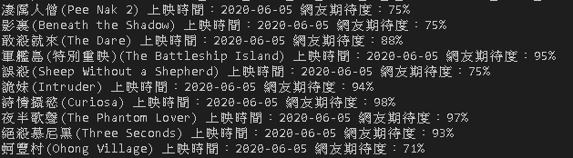
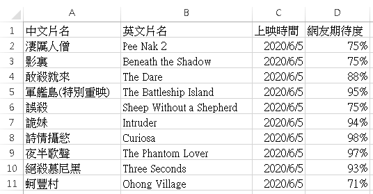

#### 安裝所需套件
`pip install -r requirements.txt`

#### 透過csv套件來實作功能
- encoding='utf-8-sig': 防止亂碼
- csv_writer = csv.writer(): 建立CSV檔寫入器
- csv_writer.writerow(): 寫入一列資料

#### 透過requests套件來實作功能
- requests.get(): 向網頁發送請求

#### 透過BeautifulSoup套件來實作功能
- soup = BeautifulSoup(): 解析網頁
- soup.find_all(): 搜尋所有節點

#### 程式說明
使用Python語言開發，透過爬蟲程式來取得Yahoo本週新電影的中英文片名、上映時間、網友期待度，

並將結果呈現與寫入CSV檔。

#### 執行結果

